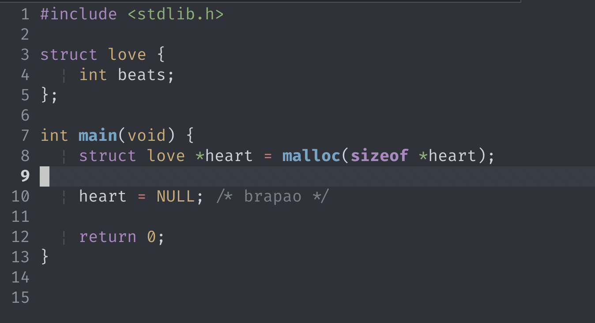
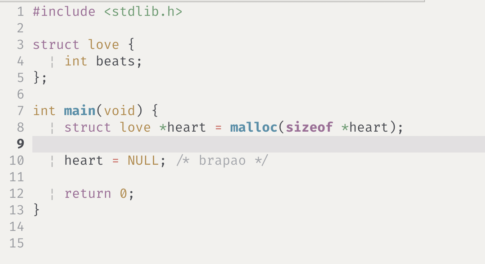

# One Half Matte

One Half Matte is a low-contrast, matte adaptation of the [One Half](https://github.com/sonph/onehalf) color scheme for Vim. It provides desaturated versions of the original palette designed for reduced eye strain while maintaining syntactic clarity.

### Dark Variant


### Light Variant


## Installation

### vim-plug

Add the following to your `.vimrc` or `init.vim`:

```vim
Plug 'SergioBonatto/One-Half-Matte'
```

Then run `:PlugInstall`.

## Configuration

To set the colorscheme, add one of the following to your configuration file:

```vim
" Dark version
colorscheme atomonedark_matte

" Light version
colorscheme atomonelight_matte
```

### Theme Toggling

The plugin includes a built-in command to toggle between the dark and light matte variants:

```vim
:OneHalfMatteToggle
```

You can map this command to a key for faster access:

```vim
nnoremap <Leader>t :OneHalfMatteToggle<CR>
```

## Features

- **atomonedark_matte**: Dark background variant with desaturated syntax highlighting.
- **atomonelight_matte**: Light background variant with a matte aesthetic.
- **Plugin Support**: Pre-configured highlight groups for NERDTree, GitGutter, ALE, CoC, FZF, Telescope, and Treesitter.
- **Terminal Colors**: Support for Neovim terminal color variables.

## Technical Details

The color schemes utilize a helper function to define highlights for both GUI and CTERM, ensuring compatibility across different terminal environments. The palette is defined using hex codes for GUI and approximate xterm-256color codes for CTERM.

## Credits

Based on the [One Half](https://github.com/sonph/onehalf) color scheme by Son Pham.
